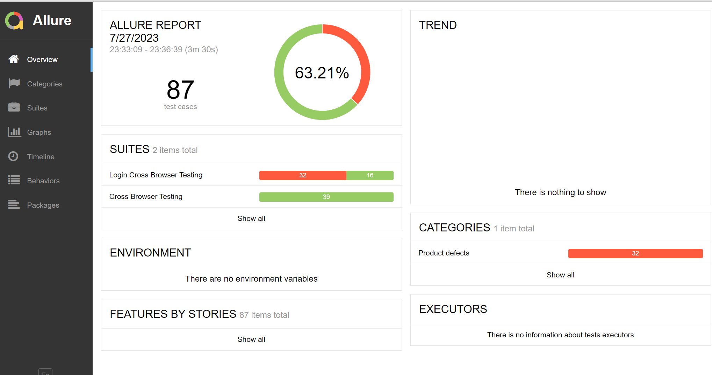
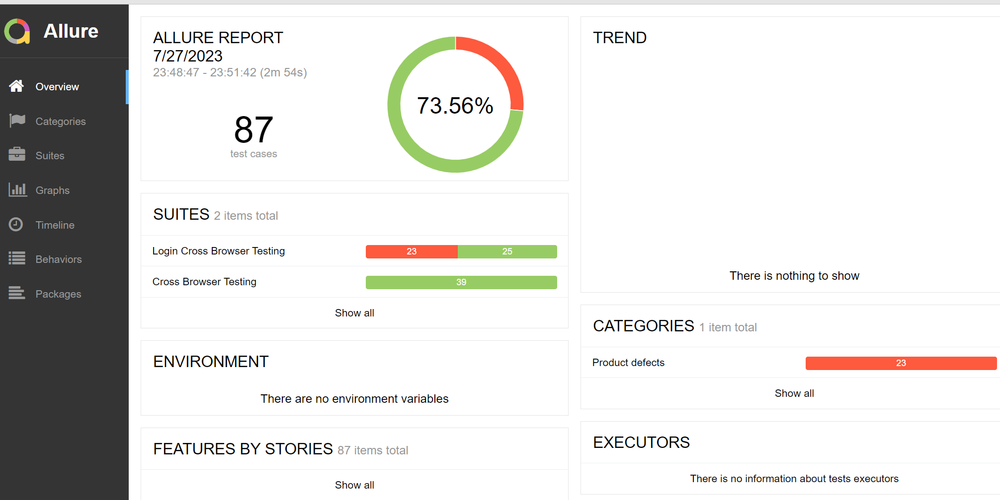

# KanboardTestProject

User credentials:
Username: username = "admin"
Password: user password = "admin" or personal access token

RUN TESTS BY COMMANDS;
mvn clean test -Pcrossbrowsertest
mvn clean test -Plogincrossbrowsertest

RUN COMMANDS TO GET ALLURE-REPORT:
- allure generate target\allure-results
- allure serve target\allure-results

